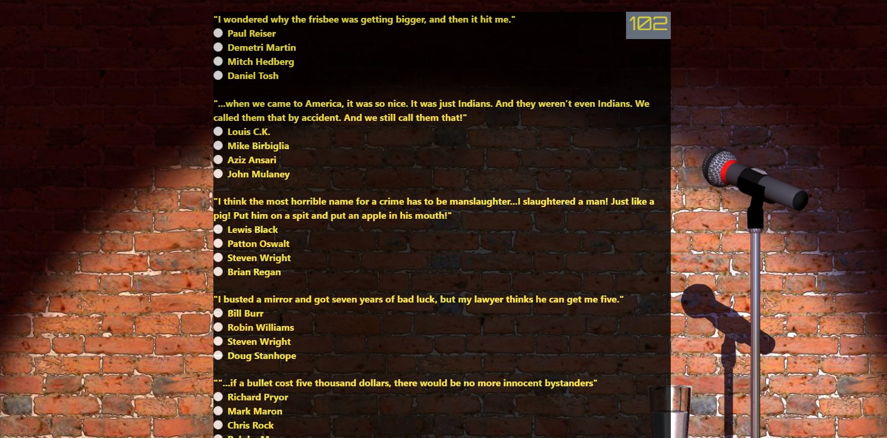
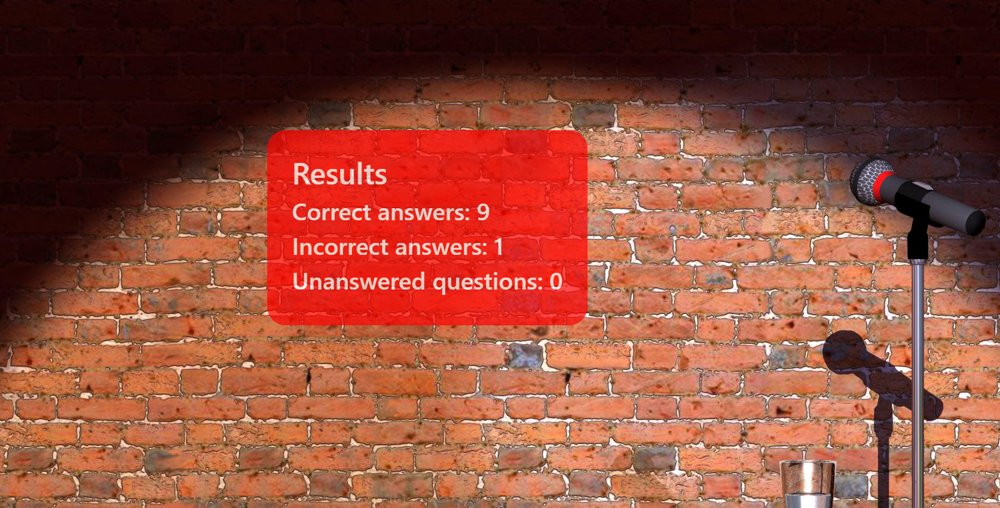

# TriviaGame

## Here is a link to the quiz:

https://efuller82.github.io/TriviaGame/

## Technologies used

- HTML
- CSS
- JQUERY

## Quiz 

User has 120 seconds to complete the 10 question quiz.  The question is a quote from a famous comedian and the user has to choose the comedian who said it.

## Results

Once the quiz is submitted or the timer is complete, the results will be displayed. 

Also, if the user passes the quiz, they will hear applause.  If the quiz is failed, a laugh-track is played. 

